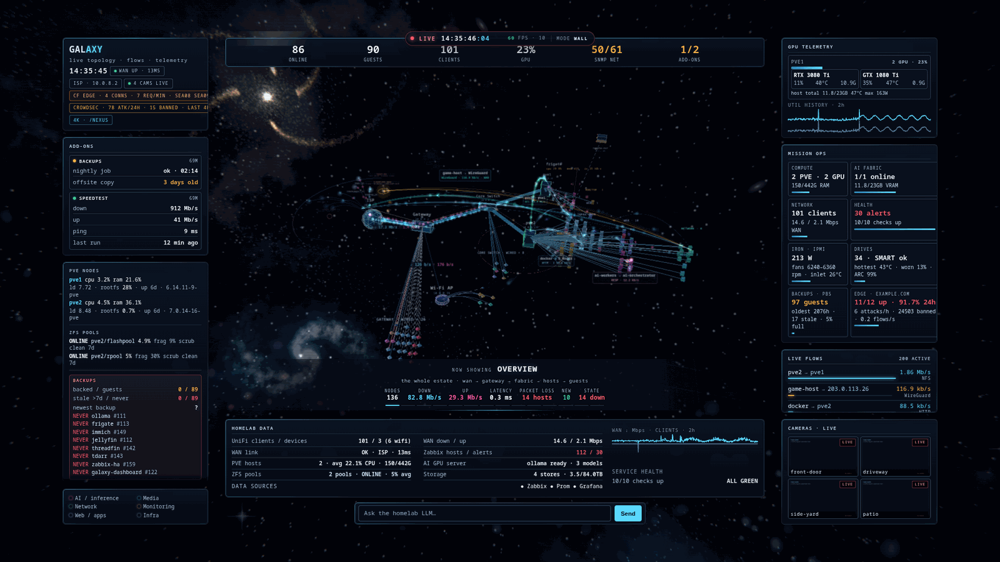
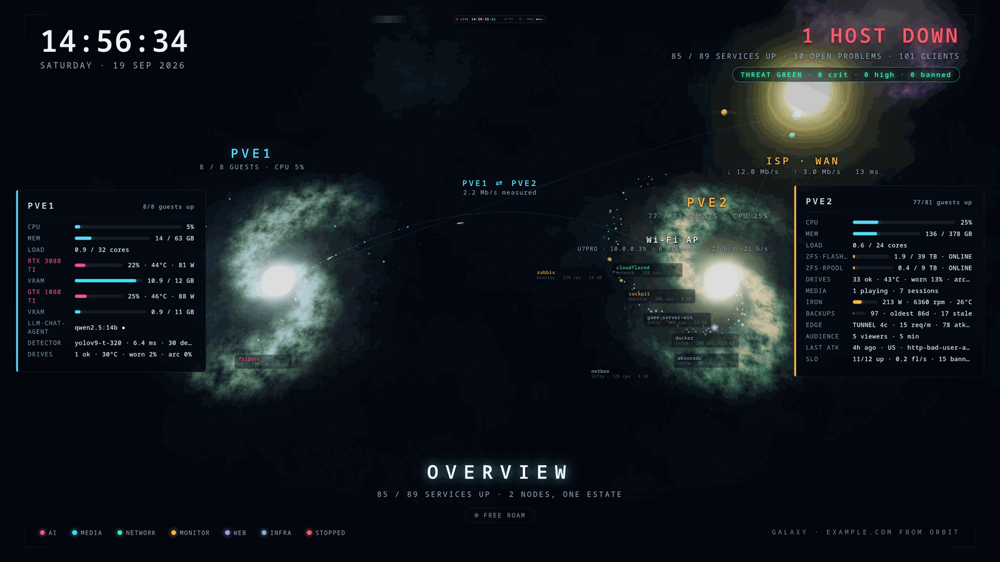
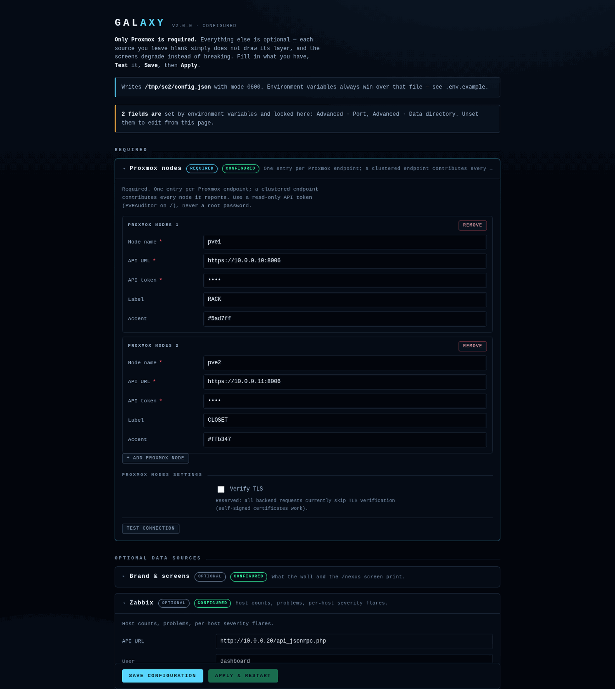
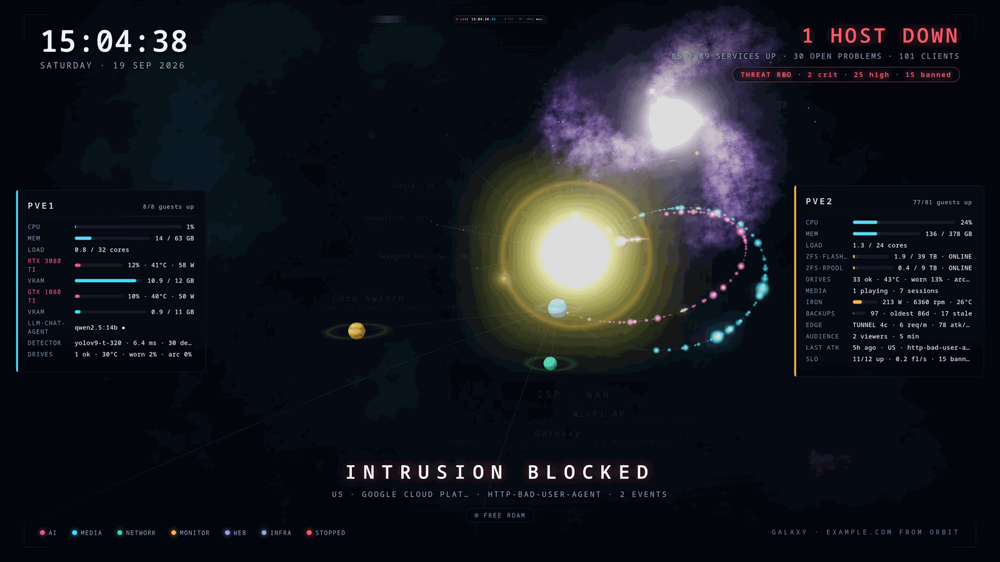

# Homelab Galaxy Dashboard

A cinematic 3D monitoring console for a Proxmox homelab, built for a wall display.

Each Proxmox node becomes a spiral galaxy. Every VM and container is a star in
its node's galaxy — coloured by what it does, sized by its RAM, dimmed when
stopped, flared when Zabbix has a problem against it. Your gateway, switch and
access point are planets with client moons. The internet edge is a sun, and
beyond it sits **the edge galaxy**: the outside world, where blocked intrusions
streak in and real visitors arrive as comets.

Nothing in the view is decorative-only. If a star is red, that guest is actually
stopped. If the room goes red, something actually attacked you.

```bash
git clone https://github.com/NetworkBound/homelab-galaxy-dashboard.git
cd homelab-galaxy-dashboard
python3 -m venv .venv && . .venv/bin/activate
pip install -r requirements.txt
DEMO=1 python3 app.py      # → http://localhost:8080  (no configuration, no network)
```

That is the whole demo. It runs on anonymised fixture data, so you can see every
layer — galaxies, the fabric, threats, viewers, the 4K view — before you give it
a single credential.



---

## Two screens, one universe

| Route | Built for | What it is |
|---|---|---|
| `/` | a 1080p monitor at your desk | **The wall.** Dense console: the network graph with measured throughput on every link, live panels, an auto-tour that flies between the WAN edge, the switch fabric, the access point and each node's categories. |
| `/nexus` | a 4K TV across the room | **Nexus.** The estate from orbit: galaxies, the solar-system fabric, the edge galaxy, rockets ferrying measured traffic. Reads from across a room and on camera. |
| `/desk` | a spare panel | The older flat HUD view, kept working. |

Run both at once and they stay in lockstep: the wall publishes its tour position
and Nexus follows it, naming the same subject at the same moment. Point two
kiosk browsers at them (see [`deploy/kiosk/`](deploy/kiosk/)) and you have a
two-screen NOC wall.



## Set it up in a browser

No YAML archaeology required. Start it with nothing configured:

```bash
python3 app.py
# [setup] token: ...        ← printed once, also saved next to config.json
```

It starts anyway and redirects you to **`/setup`**: a wizard that walks every
data source, explains what each one adds, and has a **Test** button per section
that actually tries the connection and tells you what it found
(`Zabbix 7.0.4 · 76 hosts`) before you save. Save, Apply, and it restarts itself
with the new configuration.



Prefer files? Everything the wizard writes is plain `config.json`, and every
setting also has an environment variable that overrides it — see
[`.env.example`](.env.example) and [`docs/configuration.md`](docs/configuration.md).
The layering is: **environment > `config.json` > defaults.**

## What you need

- Python 3.10+
- A Proxmox VE node or cluster (8.x / 9.x) with a **read-only** API token
- A browser with WebGL2 for the 3D view (anything else falls back to flat panels)

That is the whole requirement list. Everything else is optional, and each
optional backend only costs you its own layer if you skip it.

Create the Proxmox token on any node, as root:

```bash
pveum user add dashboard@pve
pveum aclmod / --users dashboard@pve --roles PVEAuditor
pveum user token add dashboard@pve readonly --privsep 0
```

Give the dashboard the single string `dashboard@pve!readonly=<the-uuid-it-printed>`.
`PVEAuditor` is read-only and this app issues no writes, so that token cannot
change your cluster.

## What each optional backend adds

| Backend | You get |
|---|---|
| Zabbix | Problem flares on the right star, the alert panel, host/problem counts |
| UniFi | Clients, WAN throughput, and the real physical topology: gateway, switches, APs, per-client attachment |
| Frigate | Camera satellites with live frames, detector stats |
| Emby / Jellyfin | Now-playing and session counts |
| Ollama | Per-instance loaded models and VRAM, plus the in-scene chat box |
| Prometheus | Hypervisor temperatures, fan speeds, drive health, whatever you scrape |
| ntopng | Host-to-host flow arcs with measured bandwidth and protocol |
| LibreNMS (or any SNMP topology JSON) | Devices that no controller knows about |
| Akvorado | External flows by country and autonomous system — the exosphere |
| cloudflared | Tunnel health, request rate, edge locations |
| CrowdSec | Blocked intrusions: country, AS, scenario — the red streaks |
| A security monitor | Findings mapped onto the affected host |
| Cloudflare analytics *or* an origin log | **Real unique viewers**, by country |
| NVIDIA GPUs | Utilisation, memory, temperature, power, per card and remote |
| Home Assistant | Presence gating: the screens stop rendering when the room is empty |
| Govee / Hue | The room lights follow the tour and flash red on an intrusion |

See [`docs/data-sources.md`](docs/data-sources.md) for exactly what is polled
and which credentials each one needs.

## Add-ons

Anything else you want on the wall goes in [`addons/`](addons/) as a small
Python file:

```python
TITLE = "Backups"
INTERVAL = 600

def poll(config):
    return {"status": "warn",
            "rows": [{"k": "nightly job", "v": "ok · 02:14"},
                     {"k": "offsite copy", "v": "3 days old", "cls": "warn"}]}
```

It appears in the ADD-ONS panel on the next poll. Exceptions are contained: a
broken add-on shows as `down` with its error and never touches the others. Two
working examples ship in the directory — a speed test and a generic
"fetch a URL, show these JSON keys" panel.

## Threats and viewers



Two feeds make the outside world visible:

- **Threats** merge CrowdSec decisions and security-monitor findings into one
  timeline with a monotonic sequence number. A new event streaks in from its
  country, bursts on the edge shield, names itself
  (`INTRUSION BLOCKED · US · Google Cloud · http-probing`) and — if you wired
  the lights — pulses the room red for two seconds.
- **Audience** counts *real unique visitors*, either from Cloudflare's zone
  analytics (needs a token with `Zone · Analytics · Read`) or, with no token at
  all, from your own origin access log via the exporter in
  [`deploy/edge/`](deploy/edge/). Tunnel request counters are never labelled
  "viewers" — they are shown as in-flight requests, because that is what they are.

## The 3D assets are generated, not downloaded

[`blender/galaxy_assets.py`](blender/galaxy_assets.py) is a headless Blender
script that bakes everything the scene uses — the nebula sky, the spiral galaxy
discs, the planet and star surfaces, and the rocket mesh — procedurally:

```bash
blender -b --python blender/galaxy_assets.py -- --out static/assets
```

The baked results are committed, so you never need Blender unless you want to
restyle it. Change the palette arguments and re-run to make it yours.

## Deploying

```bash
sudo ./deploy/install.sh
```

Installs to `/opt/homelab-galaxy-dashboard` with a service account, a virtualenv
and a root-owned config directory the wizard can write to, then tells you the
setup token and the URL. Also in [`deploy/`](deploy/):

- `kiosk/` — a loop-guarded Chromium kiosk, including a **dual-screen** X
  configuration (one X server, two screens: wall on one GPU, TV on the other)
  and an EDID-recovery unit for displays that come up in the wrong mode after a
  cold boot.
- `lights/` — the room-light driver (Govee over LAN UDP, Hue over the bridge).
  It follows the tour colour, dips in transit, punches on arrival and flashes
  red on a threat.
- `edge/` — the nginx log format and exporters that turn your own access log
  into real viewer counts and CrowdSec decisions into the threat feed.
- `homeassistant/` — a presence package so the screens idle when the room is
  empty, and wake when you walk in.

## HTTP API

The front end is just a client of a small JSON API; drive your own view from it.

| Endpoint | Returns |
|---|---|
| `GET /api/config` | Who this instance is: brand, nodes, palette, enabled features, add-on ids |
| `GET /api/all` | Everything: guests, nodes, storage, pools, UniFi, Zabbix, cameras, health, topology, edge, add-ons |
| `GET /api/topology` | The network graph: nodes, links with measured rates, flows, totals |
| `GET /api/gpu` | Per-GPU utilisation, memory, temperature, power |
| `GET /api/showtime` | Ollama instances, Frigate, media sessions, display mode |
| `GET /api/threats` (+ `/stream`) | The unified intrusion timeline, SSE on change |
| `GET /api/history?...` | Time series for a guest, a GPU, the network, or a host's latency |
| `GET /api/mode` · `/api/presence` (+ `/stream`) | Display mode and room presence |
| `GET /api/lightstate` (+ `/stream`) | The tour position the lights and the TV follow |
| `GET /cam/<name>.jpg` | A camera still, proxied server-side |

Full shapes, including what the screens depend on, are in
[`docs/contracts.md`](docs/contracts.md).

## Docs

- [`docs/configuration.md`](docs/configuration.md) — every setting, with defaults
- [`docs/data-sources.md`](docs/data-sources.md) — what each backend contributes
- [`docs/architecture.md`](docs/architecture.md) — pollers, cache, scene
- [`docs/contracts.md`](docs/contracts.md) — API shapes, add-on and wizard contracts
- [`docs/demo.md`](docs/demo.md) — what demo mode is and how the fixtures were made

## Troubleshooting

Every poller logs a bracketed tag (`[pve]`, `[zbx]`, `[topology]`, `[threats]`,
`[addons]`, ...) with the real exception, and never a credential. Under systemd
that is `journalctl -u homelab-dashboard`. The entries below are the failures
with non-obvious symptoms.

**I just want to see it.** `DEMO=1 python3 app.py`. No configuration is read,
no network is touched, and the fixtures drift so the scene is alive.

**The scene is black, then flat panels appear.** That is the HUD fallback. The
page gives the 3D scene a few seconds to report ready and falls back if WebGL2
is missing or a script failed. Check the browser console. On kiosk hardware with
no GPU acceleration, the HUD is the expected steady state.

**The scene renders but is empty.** No guest data arrived. Check `/api/all` for
`guests` and the log for `[pve]`: a wrong URL, an unreachable node, or a token
in the wrong format (it is one string, `user@realm!tokenid=secret`).

**Stars appear, but node vitals and storage are empty.** The configured node
*name* does not match what Proxmox calls that node. Guests come from a
cluster-wide call that works regardless; per-node calls interpolate the name.

**The wizard says 401.** The setup token is wrong or was regenerated. It is
printed at startup and stored as `setup-token` next to `config.json`.

**A setting I changed in the wizard has no effect.** An environment variable of
the same name overrides the file. The wizard shows those fields as locked.

**The camera tiles are black.** With no NVR configured the layer is off; with
one configured but unreachable the proxy returns an empty frame. The dashboard
host, not your browser, needs to reach the NVR.

**The TV and the wall disagree.** Nexus follows `/api/lightstate`, which the wall
publishes. If the wall is not running, Nexus free-roams on its own — that is the
designed fallback, not a fault.

**Something says "0 viewers" but my tunnel is busy.** Those are different
numbers on purpose. Requests through a tunnel are not visitors; configure
Cloudflare analytics or the origin-log exporter for real unique viewers.

## Security notes

- Credentials are read from the environment or a `0600` `config.json`. They are
  never logged and never sent to the browser.
- The Proxmox token should be `PVEAuditor`. This app issues no writes.
- Camera frames are proxied server-side, so browsers never need a route to the NVR.
- Outbound TLS verification is currently disabled for backend requests, which is
  what makes Proxmox's self-signed certificate work. Treat the network path
  between the dashboard and its backends as trusted.
- **There is no authentication in front of the dashboard itself.** It shows a
  read-only picture of your infrastructure. Put it behind your reverse proxy,
  SSO or a trusted VLAN. Do not expose it to the internet. The setup wizard is
  token-gated, but that protects the settings, not the view.

## Contributing

Issues and pull requests are welcome — especially support for more hardware in
the topology layer. The one hard rule: **never commit a credential, a private
IP, or a hostname from your own network.** CI enforces it: a secret scanner runs
over the working tree *and* every blob in history, and a guardrail rejects
private addresses that are not clearly placeholders. `.env` and `config.json`
are gitignored; keep it that way.

## License

MIT — see [LICENSE](LICENSE).
